<p align="center">
  <a href="https://goflinch.com/docs/agent-skill"><picture><source media="(prefers-color-scheme: light)" srcset="assets/banner-light.svg"></picture></a>
</p>

<h3 align="center">The Flinch skill for coding agents</h3>
<p align="center">Teach Claude Code, Codex, Cursor and Gemini when to reach for Flinch, and how to build with it well.</p>

<p align="center"><a href="https://goflinch.com/play"></a> <a href="https://goflinch.com/docs/models"></a> <a href="https://goflinch.com/docs/models"></a> <a href="https://goflinch.com"></a></p>

## Install

**Claude Code**

```bash
claude plugin marketplace add goflinch/skills
claude plugin install flinch@goflinch
```

**Codex, Cursor, Gemini and other agents**

```bash
npx skills add goflinch/skills --skill flinch
```

**By hand:** copy [`skills/flinch`](skills/flinch) into your agent's skills folder.

## What your agent learns

<table><tr><td align="center" width="25%"><a href="https://goflinch.com/docs/questions"><picture><source media="(prefers-color-scheme: light)" srcset="assets/icon-decide-light.svg"></picture></a><br><b>Decide</b><br><sub>typed questions, typed answers</sub></td><td align="center" width="25%"><a href="https://goflinch.com/docs/guard"><picture><source media="(prefers-color-scheme: light)" srcset="assets/icon-guard-light.svg"></picture></a><br><b>Guard before act</b><br><sub>check untrusted text first</sub></td><td align="center" width="25%"><a href="https://goflinch.com/docs/mask"><picture><source media="(prefers-color-scheme: light)" srcset="assets/icon-mask-light.svg"></picture></a><br><b>Mask</b><br><sub>personal data stays home</sub></td><td align="center" width="25%"><a href="https://goflinch.com/docs/route"><picture><source media="(prefers-color-scheme: light)" srcset="assets/icon-route-light.svg"></picture></a><br><b>Route</b><br><sub>the cheapest model that can do it</sub></td></tr></table>

| File | What it teaches |
| --- | --- |
| [`SKILL.md`](skills/flinch/SKILL.md) | When to use Flinch, the call, the five rules |
| [`references/api.md`](skills/flinch/references/api.md) | Every endpoint, field and error |
| [`references/questions.md`](skills/flinch/references/questions.md) | Writing questions that answer well, and confidence |
| [`references/patterns.md`](skills/flinch/references/patterns.md) | Fan-out, confidence gates, guard before act, routing, composite scores |
| [`references/limits.md`](skills/flinch/references/limits.md) | Where Flinch is weak, and what to do instead |

## Then ask your agent

> Add a Flinch check that routes incoming support emails to billing, shipping or technical, and sends anything under 0.8 confidence to a person.

> Before my agent follows a link, check the page with Flinch guard and stop if it's trying to steer the agent.

This repository holds instructions only: no model, no code, nothing that runs. Flinch itself runs in Flinch System on your machine.

<p align="center"><a href="https://goflinch.com"></a></p>
<p align="center"><sub><a href="https://goflinch.com/docs/">Docs</a> · <a href="https://goflinch.com/llms.txt">llms.txt</a> · <a href="https://goflinch.com/play">Stack Rush</a> · <b>#goflinch #systemzero</b></sub></p>
